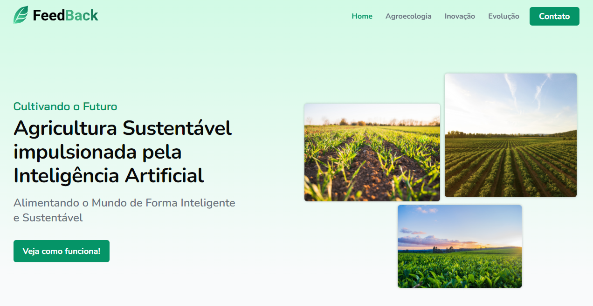

    <h2>⚜️ F E E D B A C K ⚜️</h2>

  

   

  <h3 align="center">
    <strong>
      <code>&nbsp;<a href="https://erickks.github.io/gs-feedback/">live demo</a>&nbsp;</code>
    </strong>
  </h3>

## 📚 Project

Academic project developed to solve the proposed problem through the Global Solution imposed by FIAP, being specific to the Responsive Web Development subject.

The objective of the subject in question was to create a responsive website to disseminate information about the importance of sustainable agriculture and the use of generative Artificial Intelligence in food production and distribution.

 

## 🖥 Technologies

- [Html](https://www.w3schools.com/html/)
- [Css](https://www.w3schools.com/css/)
- [Javascript](https://www.javascripttutorial.net/)
